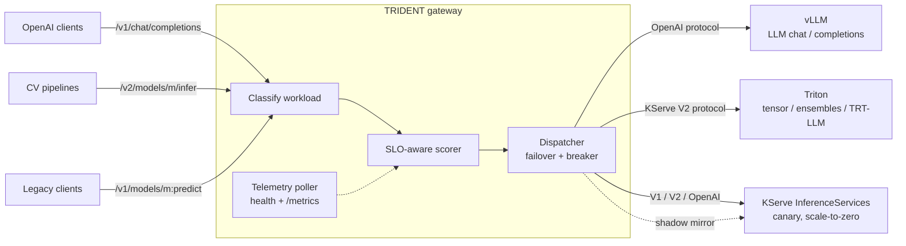

# TRIDENT

**Unified, SLO-aware inference orchestration across KServe, NVIDIA Triton, and vLLM.**

Each serving stack has a distinct sweet spot:

- **Triton** dominates CV, ensemble graphs, and TensorRT workloads.
- **vLLM** owns LLM throughput via PagedAttention and continuous batching.
- **KServe** provides the Kubernetes-native deployment lifecycle — canary rollout, scale-to-zero, revision management.

What none of them provide is a **routing brain that unifies all three under SLO-aware dispatch**. TRIDENT is that brain: a single gateway that classifies every request, scores every capable backend against live telemetry and the request's latency budget, and dispatches to the best engine — with failover, circuit breaking, canary splits, and shadow mirroring built in.



## How routing works

Every request is classified into a workload (`llm_chat`, `llm_completion`, `embedding`, `tensor`, `ensemble`), then every healthy, capable backend is scored:

```
score = w_lat · latency_fit + w_aff · affinity + w_head · headroom + w_bias · bias
```

| Term | Signal | Where it comes from |
|---|---|---|
| `latency_fit` | Predicted latency vs. the request's SLO budget | EWMA of observed latencies, inflated by in-flight requests and scraped queue depth; quadratic penalty past the budget |
| `affinity` | Engine ↔ workload fit | vLLM ≈ 1.0 for token generation, Triton ≈ 1.0 for tensor/ensemble; overridable per backend |
| `headroom` | `1 − utilization` | vLLM KV-cache usage (`vllm:gpu_cache_usage_perc`) or Triton GPU utilization (`nv_gpu_utilization`), scraped from `/metrics` |
| `bias` | Operator preference | Static per-backend config (e.g. prefer spot capacity) |

The interplay is the point: with a relaxed `batch` SLO, affinity keeps chat on vLLM even when it's slow; under a tight `interactive` SLO, the same overloaded vLLM loses to a TensorRT-LLM copy on Triton that answers in 300 ms. Clients pick their budget with one header: `x-trident-slo: interactive`.

The prediction is also **token-aware**: for LLM traffic the router estimates the request's input tokens (~4 chars/token) and scales the backend's latency EWMA by this request's size relative to the backend's average — a 32k-token prompt is not predicted at the latency of the 500-token chats that trained the EWMA (ratio clamped so outliers can't explode the estimate).

On top of scoring:

- **Failover** — if the top backend connection-errors or 5xxes, the request retries down the ranking (`routing.max_attempts`).
- **Hedged requests** — for SLO classes that opt in, if the primary hasn't answered within `delay_factor ×` its own predicted latency, the runner-up backend races it with a duplicate request; first success wins and the loser is cancelled. Classic tail-latency insurance at the cost of one duplicate on the slowest tail. Streams never hedge (two token streams can't be merged).
- **Priority load shedding** — when *every* capable backend is saturated (`inflight ≥ threshold × max_concurrency`), requests below the priority cutoff get an immediate `429` + `Retry-After` instead of queueing in front of interactive traffic. One saturated backend is a routing problem; only full saturation sheds.
- **Session affinity** — requests carrying the same `x-trident-session` key stay pinned to their backend while it remains competitive (within `min_score_ratio` of the best), so vLLM prefix caching and warm KV state actually get hits. Pins yield to drains, breaker trips, and real degradation, and the session map is TTL + LRU bounded.
- **Deadline propagation** — `x-trident-deadline-ms` caps the *total* budget including failover; remaining budget becomes the per-attempt HTTP timeout, and exhaustion returns `504` rather than starting a doomed retry.
- **Circuit breakers** — consecutive failures open the breaker; after a cooldown exactly one half-open probe is admitted (concurrent requests fail over instead of stampeding the recovering backend).
- **Draining** — `POST /admin/backends/{name}/drain` stops new traffic (inflight finishes naturally) for maintenance or model swaps; `/undrain` restores it. Session pins re-home automatically.
- **Canary** — deterministic traffic splits per model (`10% of llama-3-8b to the TRT-LLM build`), applied only across backends that passed health/breaker filters.
- **Shadow** — mirror a sample of a model's traffic to another backend, fire-and-forget, for validating a new deployment against production traffic.
- **Telemetry poller** — health checks (`/health`, `/v2/health/ready`) and Prometheus scrapes run off the request path; the scorer reads state lock-free. The scrape parser tolerates hostile payloads: NaN/Inf samples are dropped, out-of-range gauges clamped, timestamps and escaped label values handled.

## API surface

One gateway, three protocol dialects — clients keep whatever they already speak:

| Endpoint | Protocol | Workloads |
|---|---|---|
| `POST /v1/chat/completions` | OpenAI (streaming supported) | `llm_chat` |
| `POST /v1/completions` | OpenAI | `llm_completion` |
| `POST /v1/embeddings` | OpenAI | `embedding` |
| `POST /v2/models/{m}/infer` | KServe V2 / Triton native | `tensor`, `ensemble` |
| `POST /v1/models/{m}:predict` | KServe V1 | `tensor` |
| `GET /metrics` | Prometheus | router observability |
| `GET /admin/backends` | JSON | live backend state (EWMA, breaker, utilization, draining) |
| `GET /admin/models` | JSON | model → backends map |
| `POST /admin/backends/{name}/drain` / `/undrain` | JSON | maintenance mode per backend |

Request headers the router understands:

| Header | Effect |
|---|---|
| `x-trident-slo` | SLO class: latency budget, shed priority, hedging opt-in |
| `x-trident-session` | affinity key — sticky routing for KV/prefix-cache reuse |
| `x-trident-deadline-ms` | total latency budget incl. failover; `504` when exhausted |

Responses carry `x-trident-backend`, `x-trident-workload`, and `x-trident-latency-ms` headers so you can always see where a request landed and why. Shed requests return `429` with `Retry-After`.

## Quickstart (no GPUs needed)

```bash
pip install -e ".[dev]"

# Terminal 1: fake vLLM (:8001) + fake Triton (:8002)
python examples/mock_backends.py

# Terminal 2: the router
trident --config examples/demo.yaml --port 8080

# Chat goes to the vLLM backend...
curl -s localhost:8080/v1/chat/completions \
  -H 'content-type: application/json' \
  -d '{"model": "llama-3-8b", "messages": [{"role": "user", "content": "hi"}]}' -i

# ...tensor inference goes to Triton...
curl -s localhost:8080/v2/models/resnet50/infer \
  -H 'content-type: application/json' \
  -d '{"inputs": [{"name": "input0", "shape": [1,3], "datatype": "FP32", "data": [1,2,3]}]}' -i

# ...and the routing state is inspectable:
curl -s localhost:8080/admin/backends | python -m json.tool
```

Run the test suite with `pytest -q`.

## Configuration

One YAML file declares SLO classes, routing weights, backends, and canary/shadow rules — see [`config/trident.example.yaml`](config/trident.example.yaml) for the annotated full example:

```yaml
slo_classes:
  interactive: { target_p95_ms: 1500, priority: 10 }

routing:
  canary:
    - { model: llama-3-8b, stable: vllm-llama, candidate: triton-trtllm, weight: 0.10 }
  shadow:
    - { model: resnet50, target: kserve-resnet, sample: 0.20 }

backends:
  - name: vllm-llama
    kind: vllm                      # protocol defaults to openai
    base_url: http://vllm-llama.serving:8000
    metrics_url: http://vllm-llama.serving:8000/metrics
    max_concurrency: 64
    models:
      - name: llama-3-8b
        upstream_name: meta-llama/Meta-Llama-3-8B-Instruct
        workloads: [llm_chat, llm_completion]

  - name: kserve-embed
    kind: kserve
    protocol: openai                # vLLM ServingRuntime behind KServe
    base_url: http://embedder.serving.svc.cluster.local
    models:
      - name: bge-large
        workloads: [embedding]
```

KServe backends declare which dialect their predictor speaks (`v1`, `v2`, or `openai`), since KServe is a deployment layer rather than an engine — and their affinity can be overridden to match the runtime actually inside the InferenceService.

## Deploying on Kubernetes

[`deploy/k8s/`](deploy/k8s) contains a complete reference stack:

- [`trident.yaml`](deploy/k8s/trident.yaml) — the router Deployment + ConfigMap + Service
- [`backends/vllm-llama.yaml`](deploy/k8s/backends/vllm-llama.yaml) — raw vLLM deployment
- [`backends/triton-cv.yaml`](deploy/k8s/backends/triton-cv.yaml) — raw Triton deployment
- [`backends/kserve-inferenceservices.yaml`](deploy/k8s/backends/kserve-inferenceservices.yaml) — KServe-managed predictors (Triton runtime + vLLM ServingRuntime)

The intended division of labor: KServe owns the *lifecycle* of predictors that benefit from canary/scale-to-zero; raw vLLM/Triton deployments own steady-state heavy traffic; TRIDENT owns *dispatch* across all of them.

## Project layout

```
trident/
  gateway.py      # FastAPI front door: OpenAI + KServe V1/V2 endpoints, dispatch w/ failover
  router.py       # routing brain: capability filter -> canary -> SLO-aware ranking
  scoring.py      # the utility function (latency fit, affinity, headroom, bias)
  telemetry.py    # EWMAs, circuit breakers, Prometheus text parsing
  poller.py       # background health + metrics scraping loop
  registry.py     # backend runtime state (config + stats + adapter)
  adapters/       # protocol translation: vllm (OpenAI), triton (V2), kserve (V1/V2/OpenAI)
  tokens.py       # cheap input-token estimation for LLM workloads
  config.py       # pydantic schema for the YAML config
  metrics.py      # TRIDENT's own Prometheus metrics
deploy/k8s/       # reference Kubernetes manifests
examples/         # GPU-free demo (mock backends + demo config)
tests/            # 83 tests incl. industrial edge cases (overload storms, breaker
                  # thundering herds, hostile telemetry, malformed payloads)
```

## Status & roadmap

Working: unified gateway, SLO-aware + token-aware scoring, telemetry-driven dispatch, failover, hedged requests, priority load shedding, session/prefix-cache affinity, deadline propagation, circuit breaking, draining, canary, shadow, Prometheus observability, K8s manifests.

Planned:

- gRPC ingress (Triton clients that speak gRPC today)
- Cross-replica session affinity (shared session store) for multi-replica TRIDENT deployments
- KServe controller integration: watch InferenceService status instead of polling
- Autoscaling hints: export queue-pressure signals per backend as KEDA/HPA metrics

## License

MIT
